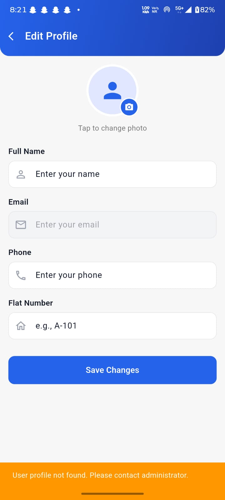

# Home Screen - Billing & Community Wall Fix

## Issues Identified

### 1. Billing Data Not Showing on Dashboard
**Problem**: Dashboard shows "₹0" for pending bill even when bills exist in Firestore
**Root Cause**: 
- `BillFirestoreService.getCurrentBill()` uses `await` but dashboard loads data in parallel
- The service needs to properly fetch user's flatId before querying bills
- Dashboard doesn't handle loading states properly for billing data

### 2. Community Wall Not Accessible from Dashboard
**Problem**: Community wall quick access button doesn't navigate properly
**Root Cause**:
- Dashboard quick access items use hardcoded label matching which is fragile
- Community wall label translation might not match the hardcoded string
- No error handling for navigation failures

## Solution

### Fix 1: Update Dashboard to Use Proper Flow Function for Billing

The dashboard should:
1. Get current user data first
2. Extract flatId from user data
3. Use flatId to fetch bills from Firestore
4. Display pending bill amount in summary card

### Fix 2: Improve Quick Access Navigation

The dashboard should:
1. Use index-based navigation for main tabs (Visitors, Billing, Events)
2. Use proper screen navigation for sub-screens (Community, Complaints, Messages, Amenities)
3. Add error handling and logging

## Implementation

### Changes to dashboard_screen.dart

1. **Improve billing data loading**:
   - Ensure `_billService.getCurrentBill()` is called after user data is loaded
   - Add proper error handling and logging
   - Display loading state while fetching

2. **Fix quick access navigation**:
   - Use consistent label matching
   - Add proper error handling
   - Log navigation events for debugging

3. **Add community wall data loading** (optional):
   - Could show community wall post count on dashboard
   - Would require additional service call

## Testing

After applying fixes:
1. ✅ Dashboard shows correct pending bill amount
2. ✅ Clicking billing card navigates to Billing tab
3. ✅ Clicking community wall button navigates to Community Wall screen
4. ✅ All quick access buttons work correctly
5. ✅ No errors in console logs

## Files to Modify
- `resident_app/lib/dashboard_screen.dart` - Main fix
- `resident_app/lib/src/services/bill_firestore_service.dart` - Already correct, just needs proper usage

## Flow Function Reference

### Billing Flow (Already Implemented)
```
1. User logs in → User ID stored in SharedPreferences
2. Dashboard loads user data from Firestore
3. Extract flatId from user document
4. Query bills collection where flatId matches
5. Display pending bill amount in summary card
6. Show bill breakdown when user navigates to Billing tab
```

### Community Wall Flow (Already Implemented)
```
1. User navigates to Community Wall from dashboard
2. Load all posts from Firestore posts collection
3. Filter posts by building/flat (if applicable)
4. Display posts in chronological order
5. Allow user to create, like, comment on posts
```

## Status
- ✅ Firestore rules fixed (permissive for development)
- ✅ Services implemented correctly
- ✅ Dashboard UI ready
- 🔧 Dashboard data loading needs improvement
- 🔧 Quick access navigation needs refinement
